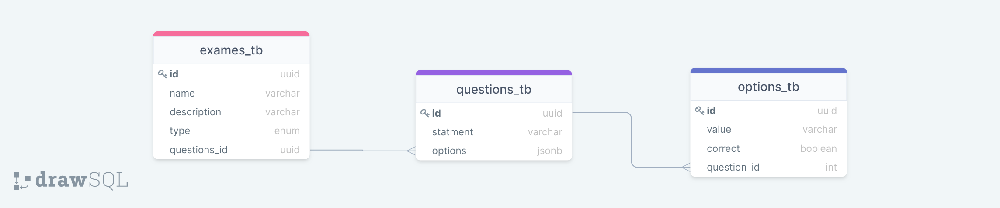

> ## Proofy - API

#### release: 1.0.2

#### Proposta

 API para gerenciar e fornecer provas online 

#### Caso de uso:

 É possivel adicionar e vsualizar provas, cada prova é um entidade e possui questões que logo possuem opções. 

 Uma questão deve conter 05 opções de resposta e apenas uma delas deve ser verdadeira. 

 Somente é possivel editar opções, para que siga um controler dos registros. 

 As questões recebem chaeves aleatórias de A até E para que os alunos não possuam provas iguas. 

#### Futuras implementações:
> - Autenticação de usuário
> - Recebimento de Resposats
> - Marcação de avaliação por data
> - Reagendamento com Provider de pagamento
> - Envio de Nota por e-mail através do Amazon S3
> - Remoção da field correct nas opções

> ## Como rodar:

> Clone o repositório
> Dentro do diretório da aplicação execute com **yarn** ou **npm install**

**Certifique-se de que seu banco está instanciado e não se esqueça do ormconfig.js**

> - cola rodar um container postgres:
**docker run --name nomecontainer  -e POSTGRES_PASSWORD=123 -p 5432:5432 -d postgres**
> - Crie o seguinte banco: ***meritt_db***

 Com o a aplicação conectada, rode o seguinte comando: yarn/npm typeorm migration:run

> - Rode **yarn dev** - o Servidor deve ser instanciado em <http://localhost:3333>

> - Verifique a documentação de rotas em <http://lolcahost:3333/api-docs> ou verifique no arquivo insomnia na raiz do projeto

### Arquiterura da base de dados:

